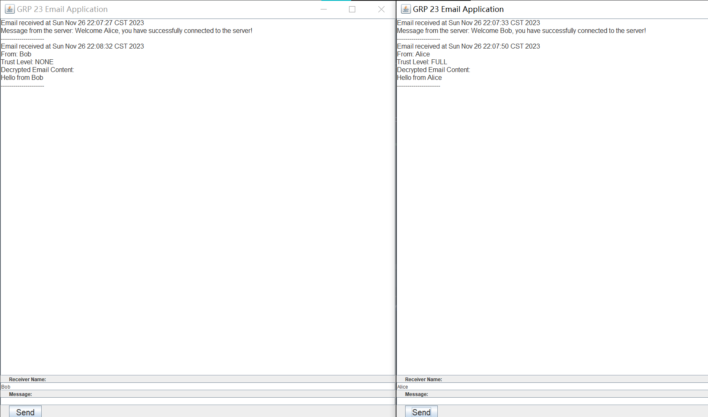

# COMP4334-PGP-Project

TODO:

1. The project used AES, but lecturer only requires DES for symmetric encryption. 
(We may consider others like CAST-128, 3DES for better security, but not AES) 

2. PGP trust model.

3. File processing, can refer to [link](https://github.com/xzx4959/PGP/blob/master/src/main/java/com/alibaba/pgp/TestPGP/KeyBasedLargeFileProcessor.java)

Server should be capable of message transfer, caching, and trust model. 

Initial implementation of the UI:
