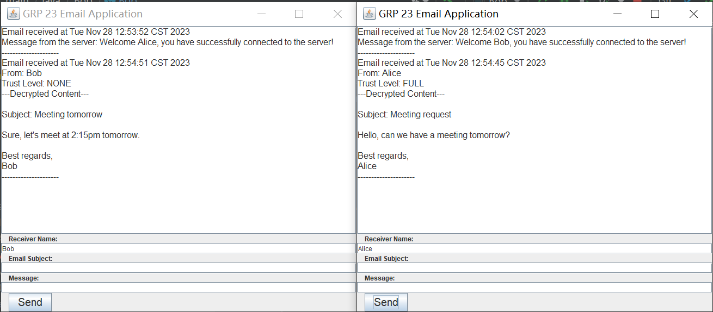

# COMP4334-PGP-Project

This project is designed to facilitate secure email transmission using PGP encryption. It provides a simple setup for sending encrypted emails between users. The implementation is based on Java and can be run using IntelliJ IDEA.

## Getting Started:
1. Open the project in IntelliJ IDEA (recommended).

2. Navigate to the src/main/java directory.

3. Run the Server.java file to start the server.

4. Run Alice.java from the src/main/java/Alice directory to launch Alice's client program.

5. Run Bob.java from the src/main/java/Bob directory to launch Bob's client program.

## Usage
-After launching Alice and Bob interfaces, you'll see input boxes in the user interface.

-In the first input box, enter the receiver's name.

-In the second input box, enter the subject of this email.

-In the third input box, enter the email text content you want to send. Signature of the email will be automatically appended.

-Click the "Send" button to initiate the encrypted email transmission.

## Note
-Ensure that the server is running normally before attempting to send emails.

-The PGP encryption ensures effective and secure communication.

-Make sure to provide valid receiver names (no space before or after the name) for successful transmission.

## Dependencies
-Java

-PGP Encryption Library (included in Maven pom file)

Implementation of the UI:

